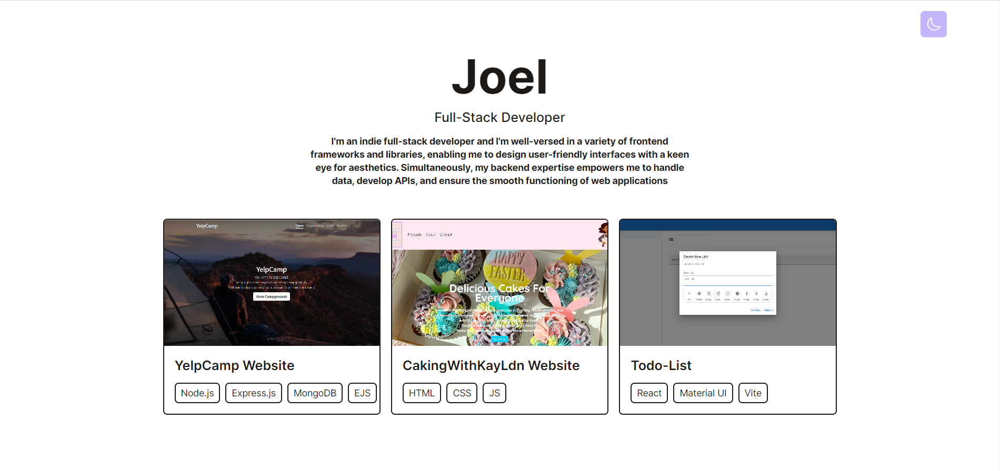
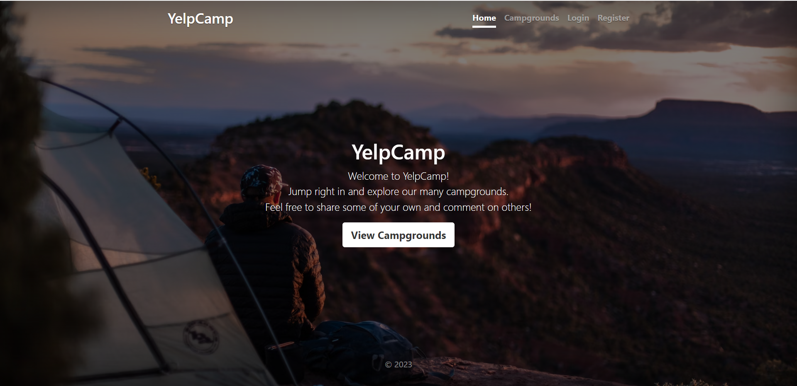
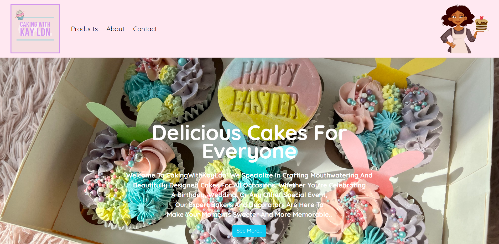
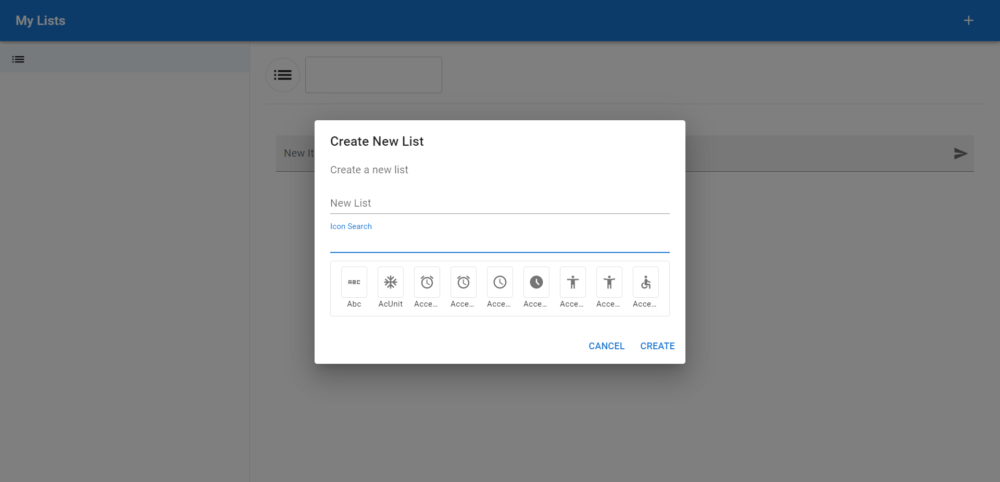

# Joel Osei's Portfolio

## Introduction

Hi there! I'm Joel Osei, a passionate and aspiring web developer. Welcome to my portfolio, where I showcase my projects and skills in the world of web development.

I'm currently a web developer, excited about building user-friendly and responsive web applications. I love the challenge of bringing ideas to life through code and enjoy learning new technologies.

## Projects

### Project 1: Portfolio Page

- Description: My portfolio website is a showcase of my web development journey. Designed and built using React, Tailwind CSS, and JavaScript, it represents my skills in crafting user-friendly and visually appealing web applications. The website features a dynamic and responsive layout that highlights my projects, skills, and background. Through this project, I've demonstrated my ability to leverage modern technologies to create engaging online experiences.
- Technologies Used: React, Tailwind.css, JavaScript
- Live Demo: https://joelosei.netlify.app/
### Project 2: YelpCamp

- Description: YelpCamp is a web application that allows users to discover and share campgrounds from around the world. Users can sign up, log in, and create their own campgrounds, complete with descriptions and images. The app provides basic functionalities for managing campgrounds, comments, and user accounts, ensuring a seamless and enjoyable user experience.
- Technologies Used: [ejs](http://ejs.co/), [Bootstrap](https://getbootstrap.com/docs/3.3/), [express](https://expressjs.com/), [mongoDB](https://www.mongodb.com/), [mongoose](http://mongoosejs.com/), [async](http://caolan.github.io/async/), [crypto](https://nodejs.org/api/crypto.html#crypto_crypto), [helmet](https://helmetjs.github.io/), [passport](http://www.passportjs.org/), [passport-local](https://github.com/jaredhanson/passport-local#passport-local), [express-session](https://github.com/expressjs/session#express-session), [method-override](https://github.com/expressjs/method-override#method-override), [cloudinary](https://cloudinary.com/), [geocoder](https://github.com/wyattdanger/geocoder#geocoder), [connect-flash](https://github.com/jaredhanson/connect-flash#connect-flash)
- Live Demo: https://campconnect.onrender.com/
- GitHub Repository: https://github.com/Oseij96/YelpCamp

### Project 3: CakingWithKayLdn

- Description: CakingWithKayLdn is a website I made for my 14 year old niece's cake business. It showcases a delightful collection of homemade cakes, brownies, and cupcakes. It aims to bring joy and sweetness to every occasion with its delectable treats that are made with love and passion for baking.
- Technologies Used: HTML5, CSS3, Bootstrap, JavaScript
- Live Demo: https://cakingwithkayldn.netlify.app/
- GitHub Repository: https://github.com/Oseij96/CakingWithKayLdn

### Project 4: Todo-List

- Description: The Todo List App is a simple and intuitive task management application built with React and Material-UI. It allows users to organize their tasks, track progress, and stay on top of their to-do lists with ease.
- Technologies Used: HTML5, CSS3, Bootstrap, JavaScript
- Live Demo: https://oseij96.github.io/Todo-List/
- GitHub Repository: https://github.com/Oseij96/Todo-List

## Skills

- HTML5, CSS3, JavaScript
- React, Tailwind.css
- Node.js, Express.js
- Database: MongoDB
- Version Control: Git, GitHub

## Contact

- Email: oseij96@gmail.com
- Portfolio Website: https://joelosei.netlify.app/

## Hire Me!

Are you looking for a dedicated and enthusiastic web developer for your team? I'm open to new opportunities and excited to work on interesting projects. Feel free to contact me for collaboration or job inquiries.
